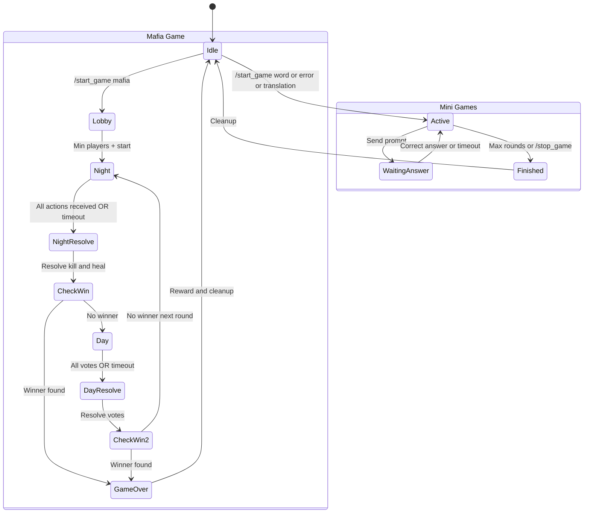

# ARCHITECTURE BLUEPRINT — Artificial Teacher v2.0

> **Document Purpose:** This is a complete, actionable architecture specification for refactoring
> "Artificial Teacher" from a monolithic 3000+ line `bot.py` into a modern, modular, scalable system.
>
> **Target Implementor:** Claude 3.5 Sonnet (or any senior developer)
>
> **Migration:** `python-telegram-bot 21.x` → `aiogram 3.x` | Sync SQLite → `aiosqlite` | Vanilla JS → `React + Vite` | No API → `FastAPI`

---

## Table of Contents

1. [Project Structure Tree](#1-project-structure-tree)
2. [Module Responsibilities & Interfaces](#2-module-responsibilities--interfaces)
3. [Database Schema Refinement](#3-database-schema-refinement)
4. [Game Engine Logic](#4-game-engine-logic)
5. [WebApp & Admin Panel Architecture](#5-webapp--admin-panel-architecture)
6. [Step-by-Step Implementation Plan](#6-step-by-step-implementation-plan)
7. [Critical Constraints & Best Practices](#7-critical-constraints--best-practices)

---

## 1. Project Structure Tree

```
artificial_teacher/
│
├── pyproject.toml                          # Project metadata + dependencies
├── requirements.txt                        # Pinned production dependencies
├── .env.example                            # Environment variable template
├── .env                                    # Local env (gitignored)
├── Dockerfile                              # Production Docker image
├── docker-compose.yml                      # Local stack (bot + api + redis)
├── render.yaml                             # Render.com deployment config
├── alembic.ini                             # Database migration config
├── README.md
│
├── alembic/                                # Database migrations
│   ├── env.py
│   ├── script.py.mako
│   └── versions/
│       └── 001_initial_schema.py
│
├── src/                                    # ══════ APPLICATION SOURCE ══════
│   ├── __init__.py
│   │
│   ├── config.py                           # Centralized settings (pydantic-settings)
│   ├── main.py                             # Entry point: starts bot + API + scheduler
│   │
│   ├── bot/                                # ══════ TELEGRAM BOT (aiogram 3.x) ══════
│   │   ├── __init__.py
│   │   ├── loader.py                       # Bot, Dispatcher, Router, Scheduler instances
│   │   ├── middlewares/
│   │   │   ├── __init__.py
│   │   │   ├── auth.py                     # User registration/upsert middleware
│   │   │   ├── throttle.py                 # Anti-flood rate limiting
│   │   │   ├── sponsor.py                  # Mandatory channel subscription check
│   │   │   └── logging.py                  # Request logging middleware
│   │   │
│   │   ├── filters/
│   │   │   ├── __init__.py
│   │   │   ├── role.py                     # RoleFilter(role="admin"|"owner")
│   │   │   ├── plan.py                     # PlanFilter(min_plan="pro")
│   │   │   └── chat_type.py               # PrivateFilter, GroupFilter
│   │   │
│   │   ├── handlers/
│   │   │   ├── __init__.py
│   │   │   ├── user/
│   │   │   │   ├── __init__.py
│   │   │   │   ├── start.py               # /start, main menu, welcome flow
│   │   │   │   ├── check.py               # Grammar check (private + group #check)
│   │   │   │   ├── translate.py           # Translation (private + group #t)
│   │   │   │   ├── pronunciation.py       # Pronunciation + TTS (private + group #p)
│   │   │   │   ├── lesson.py              # Lesson packs + AI-generated lessons
│   │   │   │   ├── grammar.py             # Grammar rules viewer
│   │   │   │   ├── voice.py               # Voice message transcription
│   │   │   │   ├── photo.py               # Photo/document OCR + check
│   │   │   │   ├── profile.py             # /mystats, progress panel
│   │   │   │   ├── settings.py            # User settings (level, mode)
│   │   │   │   ├── clear.py               # /clear chat history
│   │   │   │   └── promo.py               # /promo code redemption
│   │   │   │
│   │   │   ├── subscription/
│   │   │   │   ├── __init__.py
│   │   │   │   ├── plans.py               # /subscribe plan listing + comparison
│   │   │   │   ├── payment.py             # Payment flow (manual/auto/hybrid)
│   │   │   │   ├── receipt.py             # Receipt upload handler
│   │   │   │   ├── history.py             # /mypayments
│   │   │   │   └── points.py              # Points/promo pack redemption
│   │   │   │
│   │   │   ├── quiz/
│   │   │   │   ├── __init__.py
│   │   │   │   ├── quiz_start.py          # /quiz command + count/time/lang pickers
│   │   │   │   ├── quiz_session.py        # Question delivery, answer processing
│   │   │   │   ├── quiz_result.py         # Finish session, HTML report, level adjust
│   │   │   │   ├── iq_start.py            # /iqtest command
│   │   │   │   └── fallback_bank.py       # Static fallback questions (en/uz)
│   │   │   │
│   │   │   ├── game/
│   │   │   │   ├── __init__.py
│   │   │   │   ├── center.py              # /games command, game center menu
│   │   │   │   ├── word_game.py           # Word game (antonym/synonym)
│   │   │   │   ├── error_game.py          # Error correction game
│   │   │   │   ├── translation_game.py    # Translation race game
│   │   │   │   ├── mafia/
│   │   │   │   │   ├── __init__.py
│   │   │   │   │   ├── lobby.py           # Mafia waiting/join/leave/start
│   │   │   │   │   ├── night.py           # Night phase: kill/heal/check
│   │   │   │   │   ├── day.py             # Day phase: voting
│   │   │   │   │   ├── resolution.py      # Night/day resolution + win check
│   │   │   │   │   └── state.py           # Mafia state helpers + role assignment
│   │   │   │   ├── settings.py            # /game_settings, /set_game_time, etc.
│   │   │   │   └── scores.py             # /game_stats, /reset_game_scores
│   │   │   │
│   │   │   ├── admin/
│   │   │   │   ├── __init__.py
│   │   │   │   ├── dashboard.py           # /admin, summary stats
│   │   │   │   ├── users.py              # User search, ban/unban, grant subscription
│   │   │   │   ├── payments.py           # Pending payments, approve/reject
│   │   │   │   ├── plans.py              # Plan limit editing
│   │   │   │   ├── broadcast.py          # Broadcast text/media to all users
│   │   │   │   ├── sponsors.py           # Sponsor channel management
│   │   │   │   ├── analytics.py          # Stats, funnel, leaderboard, HTML reports
│   │   │   │   ├── marketing.py          # Reward settings, promo packs/codes
│   │   │   │   ├── config.py             # Payment config, contact config
│   │   │   │   └── group_admin.py        # Group settings (#check on/off, etc.)
│   │   │   │
│   │   │   ├── inline/
│   │   │   │   ├── __init__.py
│   │   │   │   ├── query.py              # Inline query handler
│   │   │   │   └── chosen.py             # Chosen inline result handler
│   │   │   │
│   │   │   └── group/
│   │   │       ├── __init__.py
│   │   │       ├── message.py            # Group text handler (#check, #bot, #t, #p, @mention)
│   │   │       ├── joined.py             # Bot joined group welcome
│   │   │       └── game_message.py       # Group game answer handler
│   │   │
│   │   ├── keyboards/
│   │   │   ├── __init__.py
│   │   │   ├── user_menu.py              # Main user reply keyboard
│   │   │   ├── admin_menu.py             # Admin reply keyboard
│   │   │   ├── inline.py                 # Reusable inline keyboard builders
│   │   │   └── menu_data.py              # Menu aliases, labels, constants
│   │   │
│   │   └── utils/
│   │       ├── __init__.py
│   │       ├── telegram.py               # safe_reply, safe_edit, safe_delete, escape_md
│   │       └── formatting.py             # fmt_num, fmt_price, format_plan_title
│   │
│   ├── services/                          # ══════ BUSINESS LOGIC ══════
│   │   ├── __init__.py
│   │   ├── ai_service.py                 # OpenRouter client, ask_ai(), ask_json()
│   │   ├── tts_service.py                # TopMediaI TTS, synthesize_pronunciation()
│   │   ├── quiz_service.py               # Quiz generation, validation, session management
│   │   ├── game_service.py               # Game state machine, scoring
│   │   ├── subscription_service.py       # Plan logic, upgrade credit, activation
│   │   ├── payment_service.py            # Payment creation, approval, rejection
│   │   ├── user_service.py               # User CRUD, level management, stats
│   │   ├── level_service.py              # Auto-level adjustment (signal-based + quiz-based)
│   │   ├── leaderboard_service.py        # Learning score calculation, ranking
│   │   ├── reward_service.py             # Referral, promo, cashback logic
│   │   ├── sponsor_service.py            # Sponsor channel check
│   │   ├── content_service.py            # Static lessons, rules, moderation
│   │   ├── html_export_service.py        # Jinja2 HTML rendering
│   │   ├── scheduler_service.py          # Daily word job, cleanup tasks
│   │   └── webapp_sync_service.py        # WebApp data ingestion
│   │
│   ├── database/                          # ══════ DATA ACCESS LAYER ══════
│   │   ├── __init__.py
│   │   ├── connection.py                 # aiosqlite connection pool / manager
│   │   ├── models.py                     # Pydantic/dataclass models (User, Plan, etc.)
│   │   ├── dao/
│   │   │   ├── __init__.py
│   │   │   ├── user_dao.py               # User CRUD operations
│   │   │   ├── plan_dao.py               # Plans read/update
│   │   │   ├── subscription_dao.py       # Subscription CRUD + expiry check
│   │   │   ├── payment_dao.py            # Payment CRUD
│   │   │   ├── usage_dao.py              # Daily limits tracking
│   │   │   ├── stats_dao.py              # Stats inc/get + quiz attempts
│   │   │   ├── history_dao.py            # Chat history
│   │   │   ├── quiz_dao.py               # Question history, level signals
│   │   │   ├── game_dao.py               # Group game CRUD + scores
│   │   │   ├── group_dao.py              # Group settings
│   │   │   ├── reward_dao.py             # Wallet, promo codes/packs, referral
│   │   │   ├── sponsor_dao.py            # Sponsor channels
│   │   │   ├── config_dao.py             # Payment config, reward settings
│   │   │   ├── webapp_dao.py             # WebApp progress
│   │   │   └── leaderboard_dao.py        # Leaderboard CTE queries
│   │   │
│   │   └── migrations/
│   │       └── init_schema.sql           # Full DDL for fresh install
│   │
│   ├── api/                               # ══════ FASTAPI BACKEND ══════
│   │   ├── __init__.py
│   │   ├── app.py                        # FastAPI app factory
│   │   ├── deps.py                       # Dependency injection (db session, auth)
│   │   ├── middleware/
│   │   │   ├── __init__.py
│   │   │   └── cors.py                   # CORS config for webapp
│   │   ├── routes/
│   │   │   ├── __init__.py
│   │   │   ├── health.py                 # GET / — keep-alive endpoint
│   │   │   ├── auth.py                   # POST /api/auth/validate
│   │   │   ├── user.py                   # GET /api/user/profile, stats
│   │   │   ├── quiz.py                   # POST /api/quiz/start, answer
│   │   │   ├── game.py                   # GET /api/game/leaderboard
│   │   │   ├── progress.py              # POST /api/progress/sync
│   │   │   ├── subscription.py           # GET /api/plans
│   │   │   └── admin.py                  # Admin-only endpoints
│   │   └── schemas/
│   │       ├── __init__.py
│   │       ├── auth.py
│   │       ├── user.py
│   │       ├── quiz.py
│   │       ├── game.py
│   │       ├── progress.py
│   │       └── subscription.py
│   │
│   └── templates/                         # ══════ JINJA2 HTML EXPORTS ══════
│       ├── base.html
│       ├── grammar_analysis.html
│       ├── pronunciation_guide.html
│       ├── translation_export.html
│       ├── lesson_pack.html
│       ├── quiz_result.html
│       ├── progress_report.html
│       ├── admin_stats_report.html
│       └── admin_funnel_report.html
│
├── webapp/                                # ══════ REACT + VITE FRONTEND ══════
│   ├── package.json
│   ├── vite.config.ts
│   ├── tsconfig.json
│   ├── tailwind.config.ts
│   ├── postcss.config.js
│   ├── index.html
│   ├── public/
│   │   └── favicon.svg
│   └── src/
│       ├── main.tsx
│       ├── App.tsx
│       ├── lib/
│       │   ├── api.ts                    # Axios/fetch wrapper for FastAPI
│       │   ├── telegram.ts              # Telegram WebApp SDK helpers
│       │   ├── storage.ts               # localStorage helpers
│       │   └── utils.ts
│       ├── stores/
│       │   ├── authStore.ts             # Zustand: user auth state
│       │   ├── trackerStore.ts          # Zustand: daily tracker state
│       │   ├── timerStore.ts            # Zustand: pomodoro timer state
│       │   ├── quizStore.ts             # Zustand: quiz session state
│       │   └── settingsStore.ts         # Zustand: theme, language, goals
│       ├── hooks/
│       │   ├── useAuth.ts
│       │   ├── useTimer.ts
│       │   ├── useSync.ts
│       │   └── useHaptic.ts
│       ├── components/
│       │   ├── ui/
│       │   │   ├── Button.tsx
│       │   │   ├── Card.tsx
│       │   │   ├── GlassCard.tsx        # Glassmorphism (space theme)
│       │   │   ├── GlowBadge.tsx        # Neon glow badge
│       │   │   ├── ProgressBar.tsx
│       │   │   ├── ProgressRing.tsx     # SVG circular progress
│       │   │   ├── MetricCard.tsx
│       │   │   ├── Skeleton.tsx
│       │   │   ├── Modal.tsx
│       │   │   └── Toast.tsx
│       │   ├── layout/
│       │   │   ├── AppShell.tsx
│       │   │   ├── BottomNav.tsx
│       │   │   ├── Sidebar.tsx
│       │   │   └── TopBar.tsx
│       │   ├── dashboard/
│       │   │   ├── DashboardPage.tsx
│       │   │   ├── MetricsGrid.tsx
│       │   │   ├── GoalProgress.tsx
│       │   │   ├── ActivityFeed.tsx
│       │   │   ├── LevelBadge.tsx
│       │   │   └── QuickActions.tsx
│       │   ├── focus/
│       │   │   ├── FocusPage.tsx
│       │   │   ├── TimerRing.tsx
│       │   │   ├── TimerControls.tsx
│       │   │   └── SessionHistory.tsx
│       │   ├── tracker/
│       │   │   ├── TrackerPage.tsx
│       │   │   ├── TrackerForm.tsx
│       │   │   └── SyncStatus.tsx
│       │   ├── progress/
│       │   │   ├── ProgressPage.tsx
│       │   │   ├── StatsChart.tsx
│       │   │   └── ExportButton.tsx
│       │   ├── quiz/
│       │   │   ├── QuizPage.tsx
│       │   │   ├── QuestionCard.tsx
│       │   │   ├── CountdownBar.tsx
│       │   │   ├── AnswerButton.tsx
│       │   │   └── ResultSummary.tsx
│       │   └── settings/
│       │       ├── SettingsPage.tsx
│       │       ├── ThemeToggle.tsx
│       │       └── GoalEditor.tsx
│       └── styles/
│           └── globals.css
│
├── admin/                                 # ══════ ADMIN PANEL (optional SPA) ══════
│   ├── package.json
│   ├── vite.config.ts
│   └── src/
│       ├── main.tsx
│       ├── App.tsx
│       └── components/
│           ├── AdminDashboard.tsx
│           ├── UserManagement.tsx
│           ├── PaymentQueue.tsx
│           ├── BroadcastTool.tsx
│           ├── PlanEditor.tsx
│           └── AnalyticsView.tsx
│
└── tests/                                 # ══════ TESTS ══════
    ├── conftest.py
    ├── test_services/
    │   ├── test_ai_service.py
    │   ├── test_quiz_service.py
    │   ├── test_game_service.py
    │   ├── test_subscription_service.py
    │   ├── test_level_service.py
    │   └── test_reward_service.py
    ├── test_dao/
    │   ├── test_user_dao.py
    │   ├── test_payment_dao.py
    │   └── test_game_dao.py
    ├── test_handlers/
    │   ├── test_start_handler.py
    │   └── test_quiz_handler.py
    └── test_api/
        ├── test_health.py
        ├── test_auth.py
        └── test_quiz_api.py
```

---

## 2. Module Responsibilities & Interfaces

### 2.1 `src/config.py` — Centralized Configuration

```python
from pydantic_settings import BaseSettings, SettingsConfigDict

class Settings(BaseSettings):
    model_config = SettingsConfigDict(env_file=".env", env_file_encoding="utf-8")

    # Telegram
    BOT_TOKEN: str
    OWNER_ID: int
    BOT_USERNAME: str = "@Artificial_teacher_bot"

    # Database
    DB_PATH: str = "data/engbot.db"

    # AI
    OPENROUTER_API_KEY: str = ""
    AI_MODEL: str = "openai/gpt-4o-mini"
    AI_CONCURRENCY: int = 6
    AI_TIMEOUT: int = 30
    AI_MAX_RETRIES: int = 2

    # TTS
    TOPMEDIAI_API_KEY: str = ""
    TOPMEDIAI_API_BASE: str = "https://api.topmediai.com/v1"
    TTS_CONCURRENCY: int = 3

    # API
    API_HOST: str = "0.0.0.0"
    API_PORT: int = 8080

    # URLs
    WEB_APP_URL: str = ""
    WEBHOOK_URL: str = ""
    SUPPORT_URL: str = ""
    WEBSITE_URL: str = ""

    # Features
    INLINE_HTML_CHANNEL: int = 0
    INLINE_AUDIO_CHANNEL: int = 0
    UPDATE_CONCURRENCY: int = 12
    TG_CONNECTION_POOL: int = 12

settings = Settings()
```

**Responsibility:** Single source of truth for all config. No `os.getenv()` scattered in code.

---

### 2.2 `src/bot/loader.py` — Bot Instance Factory

```python
from aiogram import Bot, Dispatcher
from aiogram.client.default import DefaultBotProperties
from aiogram.enums import ParseMode
from aiogram.fsm.storage.memory import MemoryStorage
from apscheduler.schedulers.asyncio import AsyncIOScheduler
from src.config import settings

bot = Bot(
    token=settings.BOT_TOKEN,
    default=DefaultBotProperties(parse_mode=ParseMode.MARKDOWN)
)
dp = Dispatcher(storage=MemoryStorage())
scheduler = AsyncIOScheduler(timezone="UTC")
```

---

### 2.3 `src/bot/middlewares/auth.py` — Auto User Registration

```python
from aiogram import BaseMiddleware
from aiogram.types import TelegramObject

class AuthMiddleware(BaseMiddleware):
    async def __call__(self, handler, event: TelegramObject, data: dict):
        user = data.get("event_from_user")
        if user:
            from src.services.user_service import upsert_user
            db_user = await upsert_user(user.id, user.username, user.first_name)
            data["db_user"] = db_user
        return await handler(event, data)
```

---

### 2.4 `src/bot/filters/role.py` — RBAC Filter

```python
from aiogram.filters import Filter
from aiogram.types import Message, CallbackQuery

class RoleFilter(Filter):
    def __init__(self, *roles: str):
        self.roles = set(roles)

    async def __call__(self, event: Message | CallbackQuery, db_user: dict) -> bool:
        return (db_user or {}).get("role", "user") in self.roles
```

---

### 2.5 `src/services/` — Business Logic Layer

Each service is a **stateless module** with **async functions**. No handler/telegram imports allowed.

| Service | Key Functions | Dependencies |
|---|---|---|
| `ai_service.py` | `ask_ai(text, mode, user_id) -> str`, `ask_json(text, mode, level) -> dict` | `config`, `httpx`, `asyncio.Semaphore` |
| `tts_service.py` | `synthesize(text, accent) -> bytes`, `make_audio_file(data, name) -> BytesIO` | `config`, `httpx` |
| `quiz_service.py` | `generate_question(level, qtype, lang, avoid) -> QuestionData`, `validate_answer(session, answer) -> AnswerResult`, `finish_session(session) -> SessionResult` | `ai_service`, `quiz_dao`, `level_service` |
| `game_service.py` | `create_session(chat_id, type, settings) -> GameSession`, `process_answer(chat_id, user_id, text) -> AnswerResult`, `timeout_session(chat_id) -> TimeoutResult` | `game_dao` |
| `subscription_service.py` | `get_user_plan(user_id) -> PlanInfo`, `calculate_quote(user_id, plan, days) -> Quote`, `activate(user_id, plan, days) -> None` | `subscription_dao`, `plan_dao` |
| `payment_service.py` | `create_payment(...) -> int`, `approve(id, admin) -> Payment`, `reject(id, admin, note) -> None` | `payment_dao`, `subscription_service`, `reward_service` |
| `user_service.py` | `upsert_user(id, username, name) -> User`, `get_user(id) -> User`, `ban_user(id, flag) -> None` | `user_dao` |
| `level_service.py` | `record_signal(user_id, source, level) -> None`, `auto_adjust_from_signals(user_id) -> LevelChange`, `auto_adjust_from_quiz(user_id, correct, total) -> LevelChange` | `quiz_dao`, `user_dao` |
| `leaderboard_service.py` | `get_leaderboard(limit) -> list[RankEntry]`, `get_user_rank(user_id) -> RankEntry` | `leaderboard_dao` |
| `reward_service.py` | `add_points(user_id, amount) -> None`, `redeem_promo(user_id, code) -> Result`, `process_referral(user_id, referrer) -> None` | `reward_dao` |
| `content_service.py` | `get_lesson(topic) -> LessonPack`, `get_rule(name) -> str`, `check_moderation(text) -> Warning or None` | None (static data) |
| `html_export_service.py` | `render(template, context, filename) -> BytesIO` | `Jinja2` |
| `scheduler_service.py` | `daily_word_job() -> None`, `cleanup_expired() -> None` | `ai_service`, `group_dao`, `subscription_dao` |

---

### 2.6 `src/database/connection.py` — Async DB Connection

```python
import aiosqlite
from pathlib import Path
from src.config import settings

_db: aiosqlite.Connection | None = None

async def get_db() -> aiosqlite.Connection:
    global _db
    if _db is None:
        Path(settings.DB_PATH).parent.mkdir(parents=True, exist_ok=True)
        _db = await aiosqlite.connect(settings.DB_PATH, timeout=20)
        _db.row_factory = aiosqlite.Row
        await _db.execute("PRAGMA journal_mode=WAL")
        await _db.execute("PRAGMA synchronous=NORMAL")
        await _db.execute("PRAGMA busy_timeout=7000")
        await _db.execute("PRAGMA foreign_keys=ON")
        await _db.execute("PRAGMA cache_size=-20000")
    return _db

async def close_db():
    global _db
    if _db:
        await _db.close()
        _db = None
```

---

### 2.7 `src/database/models.py` — Data Models

```python
from dataclasses import dataclass, field

@dataclass
class User:
    user_id: int
    username: str = ""
    first_name: str = ""
    role: str = "user"
    level: str = "A1"
    joined_at: str = ""
    last_seen: str = ""
    is_banned: int = 0

@dataclass
class Plan:
    id: int
    name: str
    display_name: str = ""
    price_monthly: float = 0
    price_yearly: float = 0
    checks_per_day: int = 5
    quiz_per_day: int = 3
    lessons_per_day: int = 2
    ai_messages_day: int = 10
    pron_audio_per_day: int = 5
    voice_enabled: int = 0
    inline_enabled: int = 0
    group_enabled: int = 0
    iq_test_enabled: int = 0

@dataclass
class Payment:
    id: int
    user_id: int
    plan_name: str
    amount: float
    duration_days: int = 30
    method: str = "manual"
    status: str = "pending"
    receipt_file_id: str = ""
    created_at: str = ""

@dataclass
class QuizSession:
    user_id: int
    qtype: str
    level: str
    language: str = "en"
    total_questions: int = 10
    question_timeout: int = 45
    asked: int = 0
    answered: int = 0
    correct: int = 0
    xp_earned: int = 0
    history: list = field(default_factory=list)
    used_questions: set = field(default_factory=set)
```

**Critical rule:** DAOs only contain SQL. No business logic. No Telegram imports.

---

## 3. Database Schema Refinement

### 3.1 New Tables for Gamification

```sql
-- ══════════════════════════════════════════════════════
-- XP TRANSACTION LOG (immutable audit trail)
-- ══════════════════════════════════════════════════════
CREATE TABLE IF NOT EXISTS xp_transactions (
    id          INTEGER PRIMARY KEY AUTOINCREMENT,
    user_id     INTEGER NOT NULL,
    amount      INTEGER NOT NULL,
    source      TEXT NOT NULL,             -- 'quiz_correct'|'check'|'game_win'|'streak'|'daily_login'|'pomodoro'
    source_id   TEXT DEFAULT '',
    metadata    TEXT DEFAULT '{}',
    created_at  TEXT DEFAULT (datetime('now')),
    FOREIGN KEY(user_id) REFERENCES users(user_id)
);
CREATE INDEX IF NOT EXISTS idx_xp_user ON xp_transactions(user_id);
CREATE INDEX IF NOT EXISTS idx_xp_source ON xp_transactions(source);
CREATE INDEX IF NOT EXISTS idx_xp_created ON xp_transactions(created_at);

-- ══════════════════════════════════════════════════════
-- USER XP SUMMARY CACHE
-- ══════════════════════════════════════════════════════
CREATE TABLE IF NOT EXISTS user_xp (
    user_id        INTEGER PRIMARY KEY,
    total_xp       INTEGER DEFAULT 0,
    current_level  INTEGER DEFAULT 1,     -- Gamification level (1-100), NOT English level
    xp_to_next     INTEGER DEFAULT 100,
    streak_days    INTEGER DEFAULT 0,
    longest_streak INTEGER DEFAULT 0,
    last_active_date TEXT DEFAULT '',
    daily_xp_today INTEGER DEFAULT 0,
    daily_xp_date  TEXT DEFAULT '',
    FOREIGN KEY(user_id) REFERENCES users(user_id)
);

-- ══════════════════════════════════════════════════════
-- ACHIEVEMENTS
-- ══════════════════════════════════════════════════════
CREATE TABLE IF NOT EXISTS achievements (
    id          INTEGER PRIMARY KEY AUTOINCREMENT,
    code        TEXT UNIQUE NOT NULL,     -- 'first_quiz', 'streak_7', 'level_b2'
    title       TEXT NOT NULL,
    description TEXT DEFAULT '',
    icon        TEXT DEFAULT '🏅',
    xp_reward   INTEGER DEFAULT 0,
    category    TEXT DEFAULT 'general',   -- 'general'|'quiz'|'game'|'social'|'streak'
    condition   TEXT DEFAULT '{}',        -- JSON: {"type": "streak", "value": 7}
    is_active   INTEGER DEFAULT 1
);

CREATE TABLE IF NOT EXISTS user_achievements (
    id               INTEGER PRIMARY KEY AUTOINCREMENT,
    user_id          INTEGER NOT NULL,
    achievement_code TEXT NOT NULL,
    earned_at        TEXT DEFAULT (datetime('now')),
    UNIQUE(user_id, achievement_code),
    FOREIGN KEY(user_id) REFERENCES users(user_id)
);
CREATE INDEX IF NOT EXISTS idx_ua_user ON user_achievements(user_id);

-- ══════════════════════════════════════════════════════
-- IMPROVED GAME SESSIONS (replaces active_group_games)
-- ══════════════════════════════════════════════════════
CREATE TABLE IF NOT EXISTS game_sessions (
    id           INTEGER PRIMARY KEY AUTOINCREMENT,
    chat_id      INTEGER NOT NULL,
    game_type    TEXT NOT NULL,            -- 'word'|'error'|'translation'|'mafia'
    status       TEXT DEFAULT 'waiting',   -- 'waiting'|'running'|'night'|'day'|'finished'
    round_number INTEGER DEFAULT 0,
    payload      TEXT DEFAULT '{}',
    created_by   INTEGER DEFAULT 0,
    created_at   TEXT DEFAULT (datetime('now')),
    updated_at   TEXT DEFAULT (datetime('now')),
    finished_at  TEXT
);
CREATE INDEX IF NOT EXISTS idx_gs_chat ON game_sessions(chat_id, status);

-- GAME PARTICIPATION LOG (analytics)
CREATE TABLE IF NOT EXISTS game_participations (
    id              INTEGER PRIMARY KEY AUTOINCREMENT,
    session_id      INTEGER NOT NULL,
    chat_id         INTEGER NOT NULL,
    user_id         INTEGER NOT NULL,
    points_earned   INTEGER DEFAULT 0,
    answers_correct INTEGER DEFAULT 0,
    answers_total   INTEGER DEFAULT 0,
    joined_at       TEXT DEFAULT (datetime('now')),
    FOREIGN KEY(session_id) REFERENCES game_sessions(id),
    FOREIGN KEY(user_id) REFERENCES users(user_id)
);
CREATE INDEX IF NOT EXISTS idx_gp_user ON game_participations(user_id);
CREATE INDEX IF NOT EXISTS idx_gp_session ON game_participations(session_id);

-- ══════════════════════════════════════════════════════
-- DB-BACKED QUIZ SESSIONS (replaces in-memory dict)
-- ══════════════════════════════════════════════════════
CREATE TABLE IF NOT EXISTS quiz_sessions (
    id               INTEGER PRIMARY KEY AUTOINCREMENT,
    user_id          INTEGER NOT NULL,
    qtype            TEXT DEFAULT 'quiz',
    level            TEXT DEFAULT 'A1',
    language         TEXT DEFAULT 'en',
    total_questions  INTEGER DEFAULT 10,
    question_timeout INTEGER DEFAULT 45,
    asked            INTEGER DEFAULT 0,
    answered         INTEGER DEFAULT 0,
    correct          INTEGER DEFAULT 0,
    xp_earned        INTEGER DEFAULT 0,
    status           TEXT DEFAULT 'active',
    current_question TEXT DEFAULT '{}',
    history          TEXT DEFAULT '[]',
    used_keys        TEXT DEFAULT '[]',
    chat_id          INTEGER DEFAULT 0,
    message_id       INTEGER DEFAULT 0,
    started_at       TEXT DEFAULT (datetime('now')),
    finished_at      TEXT,
    FOREIGN KEY(user_id) REFERENCES users(user_id)
);
CREATE INDEX IF NOT EXISTS idx_qs_user ON quiz_sessions(user_id, status);
```

### 3.2 XP Level Curve

```python
XP_REWARDS = {
    "quiz_correct":     15,
    "quiz_wrong":       3,
    "check":            10,
    "translation":      8,
    "pronunciation":    12,
    "lesson_complete":  25,
    "daily_login":      20,
    "streak_3":         50,
    "streak_7":         150,
    "streak_30":        500,
    "game_win":         30,
    "game_participate": 10,
    "pomodoro_complete": 15,
    "voice_message":    12,
    "referral":         100,
}
```

### 3.3 Performance Indexes for Existing Tables

```sql
CREATE INDEX IF NOT EXISTS idx_users_role ON users(role);
CREATE INDEX IF NOT EXISTS idx_users_level ON users(level);
CREATE INDEX IF NOT EXISTS idx_users_last_seen ON users(last_seen);
CREATE INDEX IF NOT EXISTS idx_subs_user ON subscriptions(user_id, is_active);
CREATE INDEX IF NOT EXISTS idx_subs_expires ON subscriptions(expires_at);
CREATE INDEX IF NOT EXISTS idx_pay_status ON payments(status);
CREATE INDEX IF NOT EXISTS idx_pay_created ON payments(created_at);
CREATE INDEX IF NOT EXISTS idx_usage_date ON daily_usage(user_id, usage_date);
CREATE INDEX IF NOT EXISTS idx_qa_user ON quiz_attempts(user_id, qtype);
CREATE INDEX IF NOT EXISTS idx_wp_user ON webapp_progress(user_id, progress_date);
```

---

## 4. Game Engine Logic

### 4.1 Game State Machine



### 4.2 Game State Storage

| Component | Storage | Rationale |
|---|---|---|
| Mini-game sessions | `game_sessions` DB table | Survives restarts |
| Mafia state | `game_sessions` DB + in-memory cache | DB for durability, cache for speed |
| Quiz sessions | `quiz_sessions` DB table | Survives restarts (critical for paid users) |
| Timeout jobs | `APScheduler` in-memory | Recreated on boot from DB state |

### 4.3 Quiz Generation Pipeline

```
1. User selects: count -> timeout -> language
2. Service creates quiz_session row in DB
3. For each question:
   a. Check prefetched question (if available)
   b. Load recent question_keys from DB (avoid repeats)
   c. Call AI: ask_json(mode="quiz_generate", level=...)
   d. Validate: check options, answer, no Uzbek in EN mode
   e. If AI fails -> retry strict mode
   f. If retry fails -> use fallback bank
   g. Estimate difficulty score
   h. Store in quiz_session.current_question
   i. Send to user with countdown
   j. Start prefetch for NEXT question (asyncio.create_task)
4. On answer:
   a. Cancel timeout job
   b. Compute XP (correct=15, wrong=3, adjusted by difficulty)
   c. Award XP, check achievement triggers
   d. Update quiz_session row
5. On finish:
   a. Auto-adjust English level
   b. Record quiz_attempt
   c. Generate HTML report
   d. Award completion XP
```

### 4.4 FastAPI Game Endpoints

```
GET  /api/game/leaderboard?chat_id={id}&limit=10
GET  /api/user/achievements?user_id={id}
GET  /api/user/xp?user_id={id}
POST /api/progress/sync  (body: {user_id, items: [{action, ...}]})
POST /api/quiz/start     (body: {user_id, qtype, count, timeout, lang})
POST /api/quiz/answer    (body: {session_id, answer})
```

---

## 5. WebApp & Admin Panel Architecture

### 5.1 Design System — Dark Space Theme (Tailwind Config)

```typescript
// tailwind.config.ts
const config = {
  content: ['./src/**/*.{ts,tsx}'],
  darkMode: 'class',
  theme: {
    extend: {
      colors: {
        space: {
          50:  '#f0f4ff',
          100: '#e0e8ff',
          200: '#c7d4fe',
          300: '#a3b6fd',
          400: '#7b8ff9',
          500: '#5b6bf3',
          600: '#4347e6',
          700: '#3636cc',
          800: '#2e2ea5',
          900: '#1a1a4e',
          950: '#0d0d2b',
        },
        neon: {
          cyan:   '#00f0ff',
          purple: '#a855f7',
          pink:   '#f472b6',
          green:  '#34d399',
          amber:  '#fbbf24',
        },
        surface: {
          DEFAULT: 'rgba(30, 30, 80, 0.6)',
          soft:    'rgba(30, 30, 80, 0.3)',
          glass:   'rgba(255, 255, 255, 0.05)',
          border:  'rgba(255, 255, 255, 0.08)',
        },
      },
      backgroundImage: {
        'glow-cyan':    'linear-gradient(135deg, #00f0ff22, #00f0ff08)',
        'glow-purple':  'linear-gradient(135deg, #a855f722, #a855f708)',
        'glow-mixed':   'linear-gradient(135deg, #00f0ff15, #a855f715)',
        'space-radial': 'radial-gradient(ellipse at 20% 0%, #1e1e5040, transparent 50%), radial-gradient(ellipse at 80% 100%, #a855f720, transparent 50%)',
        'card-gradient': 'linear-gradient(160deg, rgba(255,255,255,0.05), rgba(255,255,255,0.02))',
      },
      boxShadow: {
        'glow-cyan':   '0 0 20px rgba(0, 240, 255, 0.15), 0 0 60px rgba(0, 240, 255, 0.05)',
        'glow-purple': '0 0 20px rgba(168, 85, 247, 0.15), 0 0 60px rgba(168, 85, 247, 0.05)',
        'glow-card':   '0 8px 32px rgba(0, 0, 0, 0.3), inset 0 1px 0 rgba(255, 255, 255, 0.05)',
      },
      fontFamily: {
        sans: ['Inter', 'system-ui', 'sans-serif'],
        mono: ['JetBrains Mono', 'Fira Code', 'monospace'],
      },
      animation: {
        'glow-pulse': 'glow-pulse 2s ease-in-out infinite alternate',
        'float':      'float 6s ease-in-out infinite',
        'slide-up':   'slide-up 0.3s ease-out',
        'fade-in':    'fade-in 0.2s ease-out',
      },
      keyframes: {
        'glow-pulse': {
          '0%':   { boxShadow: '0 0 20px rgba(0, 240, 255, 0.1)' },
          '100%': { boxShadow: '0 0 40px rgba(0, 240, 255, 0.25)' },
        },
        'float': {
          '0%, 100%': { transform: 'translateY(0px)' },
          '50%':      { transform: 'translateY(-10px)' },
        },
        'slide-up': {
          '0%':   { transform: 'translateY(10px)', opacity: '0' },
          '100%': { transform: 'translateY(0)', opacity: '1' },
        },
        'fade-in': {
          '0%':   { opacity: '0' },
          '100%': { opacity: '1' },
        },
      },
    },
  },
};
export default config;
```

### 5.2 GlassCard Component

```tsx
// webapp/src/components/ui/GlassCard.tsx
interface GlassCardProps {
  children: React.ReactNode;
  className?: string;
  glow?: 'cyan' | 'purple' | 'mixed' | 'none';
  hover?: boolean;
}

export function GlassCard({ children, className = '', glow = 'none', hover = false }: GlassCardProps) {
  const glowMap = {
    cyan:   'shadow-glow-cyan border-neon-cyan/10',
    purple: 'shadow-glow-purple border-neon-purple/10',
    mixed:  'bg-glow-mixed border-neon-cyan/5',
    none:   'border-surface-border',
  };
  return (
    <div className={`
      relative overflow-hidden rounded-2xl
      bg-card-gradient backdrop-blur-xl
      border ${glowMap[glow]} shadow-glow-card
      ${hover ? 'transition-all duration-300 hover:scale-[1.02] hover:shadow-glow-cyan' : ''}
      ${className}
    `}>{children}</div>
  );
}
```

### 5.3 State Management (Zustand)

```typescript
// webapp/src/stores/trackerStore.ts
import { create } from 'zustand';
import { persist } from 'zustand/middleware';

interface TrackerState {
  words: number;
  quizzes: number;
  lessons: number;
  points: number;
  goals: { words: number; quiz: number; lessons: number };
  syncQueue: SyncItem[];
  setWords: (n: number) => void;
  queueSync: (item: SyncItem) => void;
  flushSync: () => SyncItem[];
}

export const useTrackerStore = create<TrackerState>()(
  persist(
    (set, get) => ({
      words: 0, quizzes: 0, lessons: 0, points: 0,
      goals: { words: 20, quiz: 5, lessons: 2 },
      syncQueue: [],
      setWords: (n) => set({ words: n }),
      queueSync: (item) => set(s => ({
        syncQueue: [...s.syncQueue.slice(-19), item]
      })),
      flushSync: () => {
        const items = get().syncQueue;
        set({ syncQueue: [] });
        return items;
      },
    }),
    { name: 'at-tracker-v2' }
  )
);
```

### 5.4 API Integration Layer

```typescript
// webapp/src/lib/api.ts
const API_BASE = import.meta.env.VITE_API_URL || '';

export async function api<T>(endpoint: string, opts: { method?: string; body?: unknown } = {}): Promise<T> {
  const tg = window.Telegram?.WebApp;
  const res = await fetch(`${API_BASE}${endpoint}`, {
    method: opts.method || 'GET',
    headers: {
      'Content-Type': 'application/json',
      'X-Telegram-Init-Data': tg?.initData || '',
    },
    body: opts.body ? JSON.stringify(opts.body) : undefined,
  });
  if (!res.ok) throw new Error(`API ${res.status}`);
  return res.json();
}

export const userApi = {
  profile: () => api('/api/user/profile'),
  stats:   () => api('/api/user/stats'),
  xp:      () => api('/api/user/xp'),
};

export const quizApi = {
  start:  (p: any) => api('/api/quiz/start', { method: 'POST', body: p }),
  answer: (p: any) => api('/api/quiz/answer', { method: 'POST', body: p }),
};

export const progressApi = {
  sync: (items: any[]) => api('/api/progress/sync', { method: 'POST', body: { items } }),
};
```

### 5.5 User WebApp Component Hierarchy

```
App
├── AppShell
│   ├── TopBar (level badge, XP bar, streak fire)
│   ├── BottomNav (5 tabs: Dashboard, Focus, Tracker, Quiz, Settings)
│   │
│   ├── DashboardPage
│   │   ├── MetricsGrid (4x MetricCard: XP, Focus, Completion, Level)
│   │   ├── GoalProgress (3x ProgressBar: words/quiz/lessons)
│   │   ├── QuickActions (Start Focus, Open Quiz, Sync)
│   │   ├── ActivityFeed
│   │   └── GlassCard[glow=purple] (Upsell / Plan info)
│   │
│   ├── FocusPage
│   │   ├── TimerRing (animated SVG, neon-cyan glow)
│   │   ├── TimerControls (Start/Pause/Reset)
│   │   ├── SessionHistory
│   │   └── FocusSettings (duration, Pro gate)
│   │
│   ├── TrackerPage
│   │   ├── TrackerForm (inputs + topics/note)
│   │   ├── SyncStatus
│   │   └── ActionButtons (Save, Sync to Bot)
│   │
│   ├── QuizPage
│   │   ├── QuizSetup (count/timeout/lang pickers)
│   │   ├── QuestionCard + 4x AnswerButton
│   │   ├── CountdownBar
│   │   └── ResultSummary (score, XP, level change)
│   │
│   ├── ProgressPage
│   │   ├── StatsChart (bar chart)
│   │   ├── AchievementGrid (badges with glow)
│   │   └── ExportButton (JSON, Pro gate)
│   │
│   └── SettingsPage
│       ├── ThemeToggle (Dark/Light/System)
│       ├── GoalEditor
│       ├── HapticToggle
│       └── ResetButton
```

### 5.6 Admin Panel Hierarchy

```
AdminApp
├── AdminLayout + AdminSidebar
│   ├── AdminDashboard (stats cards, revenue chart)
│   ├── UserManagement (search, detail, ban, grant)
│   ├── PaymentQueue (receipt preview, approve/reject)
│   ├── BroadcastTool (composer, audience, progress)
│   ├── PlanEditor (editable limits per plan)
│   └── AnalyticsView (funnel, leaderboard, export)
```

---

## 6. Step-by-Step Implementation Plan

### Phase 0: Foundation (Day 1)

```
Step 0.1: Create full project directory structure from Section 1.
Step 0.2: Create pyproject.toml with:
          aiogram>=3.4, aiosqlite>=0.20, httpx>=0.27, pydantic-settings>=2.0,
          python-dotenv>=1.0, Jinja2>=3.1, APScheduler>=3.10, fastapi>=0.110, uvicorn>=0.29
Step 0.3: Create src/config.py (Section 2.1).
Step 0.4: Create src/database/connection.py (Section 2.6).
Step 0.5: Create src/database/models.py (Section 2.7).
Step 0.6: Create .env.example with all settings keys.
```

### Phase 1: Database Migration (Day 2)

```
Step 1.1: Create src/database/migrations/init_schema.sql with ALL tables (existing + Section 3).
Step 1.2: Create async init_db() that runs DDL + ALTER TABLE migrations for backward compat.
Step 1.3: Implement ALL 15 DAO modules in src/database/dao/.
Step 1.4: Test DAO layer: pytest tests/test_dao/.
```

### Phase 2: Services Layer (Day 3-4)

```
Step 2.1: ai_service.py — Port utils/ai.py, add Semaphore + retry.
Step 2.2: tts_service.py — Port utils/tts.py.
Step 2.3: user_service.py, subscription_service.py, payment_service.py.
Step 2.4: level_service.py — Port signal-based + quiz-based auto-adjust.
Step 2.5: quiz_service.py — Port generation pipeline, DB-backed sessions.
Step 2.6: game_service.py — Port word/error/translation + mafia state machine.
Step 2.7: Remaining: reward, content, html_export, scheduler, leaderboard.
Step 2.8: Test: pytest tests/test_services/.
```

### Phase 3: Bot Handlers — aiogram 3.x (Day 5-7)

```
Step 3.1: Create src/bot/loader.py (Section 2.2).
Step 3.2: Implement middlewares (auth, throttle, sponsor).
Step 3.3: Implement filters (role, plan, chat_type).
Step 3.4: Implement src/bot/utils/telegram.py (safe_reply, safe_edit, safe_delete, escape_md).
Step 3.5: Implement user handlers (start, check, translate, pronunciation, lesson, grammar, voice, photo, profile, settings, clear, promo).
Step 3.6: Implement subscription handlers (plans, payment, receipt, history, points).
Step 3.7: Implement quiz handlers (quiz_start, quiz_session, quiz_result, iq_start).
Step 3.8: Implement game handlers (center, word_game, error_game, translation_game, mafia/*).
Step 3.9: Implement admin handlers (all 10 files).
Step 3.10: Implement inline handlers (query, chosen).
Step 3.11: Implement group handlers (message, joined, game_message).
Step 3.12: Register all routers in src/main.py.
```

### Phase 4: FastAPI Backend (Day 8)

```
Step 4.1: Create src/api/app.py with CORS.
Step 4.2: Implement Telegram initData HMAC validation in src/api/deps.py.
Step 4.3: Implement endpoints (health, auth, user, quiz, progress, game).
Step 4.4: Create src/api/schemas/ with Pydantic models.
```

### Phase 5: Entry Point (Day 8)

```python
# src/main.py
async def main():
    await init_db()
    register_all_handlers(dp)
    register_jobs(scheduler, bot)
    scheduler.start()
    # Start FastAPI in background task
    # Start bot polling (or webhook)
```

### Phase 6: React WebApp (Day 9-11)

```
Step 6.1: npx -y create-vite@latest ./ --template react-ts
Step 6.2: npm install zustand recharts; npm install -D tailwindcss postcss autoprefixer
Step 6.3: Configure Tailwind with Dark Space theme (Section 5.1).
Step 6.4: Design system components (GlassCard, Button, ProgressBar, ProgressRing, MetricCard).
Step 6.5: Layout components (AppShell, BottomNav, TopBar).
Step 6.6: Zustand stores (Section 5.3).
Step 6.7: API layer (Section 5.4).
Step 6.8: Pages: Dashboard -> Focus -> Tracker -> Quiz -> Progress -> Settings.
Step 6.9: Test in Telegram WebApp mode.
```

### Phase 7: Testing & Deployment (Day 12)

```
Step 7.1: Unit tests for services.
Step 7.2: Integration tests for DAOs with in-memory SQLite.
Step 7.3: Handler tests using aiogram test utilities.
Step 7.4: Full test: pytest tests/ -v
Step 7.5: Manual integration: /start -> each menu item -> full user flow.
Step 7.6: Update Dockerfile + docker-compose.yml.
Step 7.7: Deploy to Render.com / VPS.
```

---

## 7. Critical Constraints & Best Practices

### 7.1 Absolute Rules

| # | Rule | Rationale |
|---|---|---|
| 1 | **async/await everywhere.** No sync DB. No time.sleep(). | aiogram 3.x is fully async |
| 2 | **No raw SQL in handlers.** All DB through DAOs. | Separation of concerns |
| 3 | **No Telegram imports in services/ or database/.** | Framework-agnostic, testable |
| 4 | **Type hints on ALL function signatures.** | IDE support, code review |
| 5 | **Every handler must have try/except.** | One error must not crash bot |
| 6 | **No mutable global state for sessions.** Use DB. | In-memory dicts lost on restart |
| 7 | **Parameterized queries only.** No f-strings in SQL. | Prevent SQL injection |
| 8 | **Middleware order:** logging -> throttle -> auth -> sponsor -> handler | Auth before sponsor check |
| 9 | **Preserve ALL existing functionality.** REFACTOR not rewrite. | No features lost |
| 10 | **Backward compatible DB.** ALTER TABLE migrations. | Users keep their data |

### 7.2 Error Handling Pattern

```python
async def some_handler(message: Message, db_user: dict):
    try:
        # handler logic
    except Exception as e:
        logger.exception("Handler error: %s", e)
        await safe_reply(message, "Texnik xatolik. Qayta urinib ko'ring.")
```

### 7.3 aiogram 3.x Migration Cheatsheet

| python-telegram-bot | aiogram 3.x |
|---|---|
| `CommandHandler("start", fn)` | `router.message(Command("start"))` |
| `CallbackQueryHandler(fn, pattern=r"...")` | `router.callback_query(F.data.startswith("..."))` |
| `context.bot.send_message(...)` | `await bot.send_message(...)` |
| `update.effective_user` | `message.from_user` |
| `update.effective_message.reply_text(...)` | `await message.answer(...)` |
| `query.edit_message_text(...)` | `await callback.message.edit_text(...)` |
| `context.user_data[key]` | `FSMContext` or DB-backed state |
| `context.job_queue.run_once(...)` | `APScheduler` |
| `filters.ChatType.GROUPS` | `ChatTypeFilter(chat_type=["group","supergroup"])` |

### 7.4 File Size Limits

| File Type | Max Lines | Action if exceeded |
|---|---|---|
| Handler file | 300 | Split into sub-handlers |
| Service file | 400 | Split into sub-services |
| DAO file | 200 | Split by entity |
| React component | 200 | Extract sub-components |
| main.py | 80 | Move logic to modules |

### 7.5 Naming Conventions

```
Files:       snake_case.py, PascalCase.tsx
Classes:     PascalCase
Functions:   snake_case
Constants:   UPPER_SNAKE_CASE
DB Tables:   snake_case
API Routes:  /api/kebab-case
React Stores: camelCase
```

### 7.6 Security Rules

1. Telegram initData validation: verify HMAC-SHA256 signature
2. Admin endpoints must check user role from DB
3. No secrets in logs — mask API keys before logging
4. Rate limiting: max 1 msg/sec per user
5. SQL injection: parameterized queries ONLY
6. XSS: always html.escape() in HTML exports, Jinja2 autoescape

---

> **END OF BLUEPRINT**
>
> Follow phases in order. Test each phase before next.
> Prioritize **working code** over **perfect architecture**.
